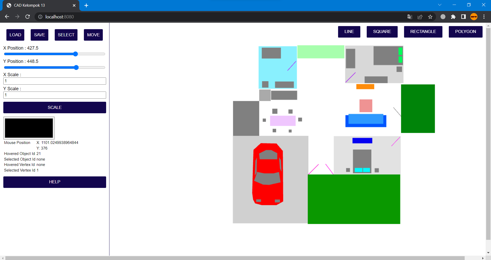

# CAD_Kel13

Tubes Grafkom Kelompok 13

Untuk mempermudah penggunaan program kami menggunakan Yarn sebagai package manager, untuk menginstall Yarn diperlukan Node.js, dan dengan menggunakan command:

`npm install --global yarn`

Berikutnya buka folder repository dan jalankan command:

`yarn`

Hal ini dilakukan untuk menginstall dependencies dan package pada yarn, ikuti proses instalasi dan tunggu hingga selesai.

Setelah proses instalasi selesai, masukan command berikut untuk memulai dan mengakses program:

`yarn start`

Program akan berjalan dan terbuka halaman web yang berjalan di localhost devices anda.

Setelah itu program bisa diakses langsung menggunakan tombol menu dan drawing area yang tersedia.
